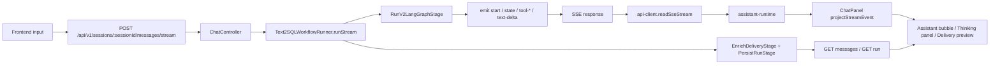

# Text2SQL 项目前后端 A2A 流式协议说明

本文基于当前仓库实现，解释聊天主链路里这套“前端 Agent UI <-> 后端 Agent Runtime”协议到底如何工作。

这里的 “A2A” 是本项目内部叫法，重点不是多 Agent 联邦通信，而是：

- 前端如何把用户问题送入后端运行时
- 后端如何把运行中的结构化事件持续推回前端
- 前端如何把这些事件投影成聊天气泡、thinking panel、tool 过程和最终 delivery

底层传输不是 WebSocket，而是：

`HTTP POST + SSE(text/event-stream)`

## 1. 一句话先记住

本项目的主链路不是“发消息，然后等一整段回答返回”，而是：

`message/contextEnvelope 入站 -> backend 创建 run -> SSE 持续推送 ChatStreamEvent -> frontend 分别消费 text/state/tool/finish/error -> 回读持久化 messages/run 对齐最终事实`

这是一套“结构化事件流协议”，不是“纯文本流协议”。

## 2. 读代码顺序

如果你是第一次读这条链路，建议按这个顺序看。

协议合同与工具：

- `packages/shared-types/src/api.ts`
- `packages/chat-stream-protocol/src/types.ts`
- `packages/chat-stream-protocol/src/server.ts`
- `packages/chat-stream-protocol/src/client.ts`
- `packages/chat-stream-protocol/src/ui.ts`

后端入口：

- `apps/backend/src/modules/conversation/chat/chat.controller.ts`
- `apps/backend/src/modules/conversation/chat/chat.service.ts`
- `apps/backend/src/modules/conversation/application/workflow/text2sql-workflow-runner.service.ts`
- `apps/backend/src/modules/conversation/text2sql/stream/text2sql-stream-event.mapper.ts`
- `apps/backend/src/modules/llm/llm-gateway.interface.ts`

前端入口：

- `apps/frontend/src/lib/api-client.ts`
- `apps/frontend/src/components/chat/assistant-runtime.ts`
- `apps/frontend/src/components/chat-panel.tsx`
- `apps/frontend/src/components/chat/assistant-thread.tsx`
- `apps/frontend/src/components/chat/run-visibility-mapper.ts`

## 3. 责任分层

当前实现把协议责任拆成了三层。

### 3.1 `packages/shared-types`

这里是协议的单一事实源，定义：

- `ChatStreamEventType`
- `ChatStreamEventData`
- `ChatStreamEvent`
- `DeliveryContract`
- `AgentRunResponse`

也就是说，事件 envelope 和 finish 里的 delivery 合同都以这里为准。

### 3.2 `packages/chat-stream-protocol`

这里是协议工具层，不再让前后端各自维护一套 parser / writer / terminal 判定逻辑。

它负责：

- 服务端写 SSE：`serializeSseEvent`、`writeSseEvent`、`writeErrorEvent`
- 客户端读 SSE：`readSseStream`
- envelope 校验：`validateChatStreamEnvelope`
- terminal 判定：`isTerminalEvent`
- 文本增量拼接：`collectTextDelta`
- UI 投影：`projectStreamEvent`

### 3.3 backend / frontend 业务代码

业务层只消费协议，不再重新定义协议。

- backend 负责“什么时候 emit 什么事件”
- frontend 负责“收到事件后如何更新 UI 状态”

## 4. 总体时序



## 5. 请求如何进入后端

### 5.1 前端真正发请求的地方

流式请求从这里发起：

- `apps/frontend/src/lib/api-client.ts`
- `streamMessageEvents(sessionId, message, abortSignal, contextEnvelope)`

真实请求目标：

```text
/api/v1/sessions/:sessionId/messages/stream
```

请求方式仍然是普通 `fetch POST`，不是 `EventSource GET`。

### 5.4 用户停止生成如何传播

前端 stop 不是只停止浏览器读流，而是沿着同一条运行链路把取消信号向后传递：

- `apps/frontend/src/components/chat/assistant-composer.tsx` 提供停止按钮
- `apps/frontend/src/components/chat/assistant-runtime.ts` 为当前流维护 `AbortController`
- `apps/frontend/src/lib/api-client.ts` 把 `abortSignal` 传给 `fetch`
- `apps/backend/src/modules/conversation/chat/chat.controller.ts` 监听 request / response close，并创建 run-scoped `AbortController`
- `apps/backend/src/modules/conversation/application/workflow/text2sql-workflow-runner.service.ts` 把 `abortSignal` 继续传给 LangGraph runtime
- `apps/backend/src/modules/conversation/runtime/langgraph/text2sql-v2-langgraph.graph.ts` 在阶段边界做 cooperative abort check
- `apps/backend/src/modules/conversation/nodes/generate-sql.node.ts` / `agent/sql/sql-generation.service.ts` / `modules/llm/llm-gateway.service.ts` 最终把 signal 传到 provider stream

第一版取消语义不新增公开 stream event type，而是继续使用既有 terminal `error` 事件，并约定：

```ts
{
  type: "error",
  data: {
    code: "USER_CANCELLED",
    message: "用户已停止本轮生成。"
  }
}
```

前端把它投影为“已停止生成”，保留已经产生的文本和 thinking/tool 过程，而不是把它显示成普通 provider failure。

### 5.2 请求体

当前请求体合同来自 `SendMessageRequest`：

```ts
{
  message: string,
  contextEnvelope?: {
    metricDefinition?,
    timeRange?,
    entityMappings?,
    mustIncludeTables?,
    mustExcludeTables?,
    pinnedTables?,
    pinnedColumns?,
    businessConstraints?
  }
}
```

真正最核心的用户输入字段仍然是：

```ts
message: "用户自然语言问题"
```

### 5.3 额外请求头

前端还会附带这些 header：

- `x-user-role`
- `x-user-id`
- `x-workspace-id`（可选）

这些不是 SSE 协议本身的一部分，但它们会影响后端的 actor / workspace 上下文。

## 6. 为什么这是 SSE，不是 WebSocket

后端流式接口在 `chat.controller.ts` 里直接设置：

```ts
Content-Type: text/event-stream; charset=utf-8
Cache-Control: no-cache, no-transform
Connection: keep-alive
```

然后通过 `writeSseEvent` 把事件一条条写入响应。

标准 framing 形式是：

```text
event: <event-type>
data: <json>

```

也就是：

```ts
`event: ${eventType}\ndata: ${JSON.stringify(event)}\n\n`
```

注意两点：

1. 这条路的 HTTP 状态码主要表示“传输是否建立成功”，不表示业务是否成功。
2. 业务失败通常通过流内 `error` 事件返回，而不是依赖最终 HTTP 4xx/5xx。

## 7. 协议 envelope 长什么样

所有流事件统一都是这个壳子：

```ts
interface ChatStreamEvent {
  type: ChatStreamEventType;
  runId: string;
  sessionId: string;
  at: string;
  data: ChatStreamEventData;
}
```

这 5 个字段是协议最关键的骨架：

- `type`
- `runId`
- `sessionId`
- `at`
- `data`

前端解析时会校验：

- payload 必须是对象
- `type` 必须是受支持的事件类型
- `runId` / `sessionId` / `at` 必须是非空字符串
- SSE `event:` 行上的名字必须和 JSON 里的 `type` 一致

这也是 `packages/chat-stream-protocol` 存在的意义之一：避免 writer / parser 不一致。

## 8. 当前事件 taxonomy

协议事件类型固定为：

```ts
type ChatStreamEventType =
  | "start"
  | "text-delta"
  | "tool-call"
  | "tool-result"
  | "tool-error"
  | "state"
  | "finish"
  | "error";
```

协议工具层定义的 terminal 事件只有两类：

- `finish`
- `error`

其中“用户主动停止”在当前实现中仍属于 `error` terminal，只是 `code` 固定为 `USER_CANCELLED`。

### 8.1 `start`

表示本次 run 已经建立，常用于：

- 给 UI 创建一个新的活动 run
- 把 run 标成 loading
- 初始化 thinking 容器

`data` 结构：

```ts
{ requestId: string | null }
```

### 8.2 `text-delta`

表示回答文本的增量输出。

`data` 结构：

```ts
{ text: string }
```

前端不会把每条 delta 当作独立消息，而是用 `collectTextDelta` 持续拼接成当前 assistant 文本。

### 8.3 `tool-call`

表示模型触发了一次工具调用。

`data` 结构核心字段：

```ts
{
  toolName: string;
  toolCallId: string;
  input?: unknown;
  title?: string;
  stage?: ReasoningStage;
  summary?: string;
}
```

### 8.4 `tool-result`

表示工具返回成功结果。

核心字段与 `tool-call` 类似，只是把 `input` 换成 `output`。

### 8.5 `tool-error`

表示工具调用失败。

核心字段：

```ts
{
  toolName: string;
  toolCallId: string;
  message: string;
  title?: string;
  stage?: ReasoningStage;
  summary?: string;
}
```

### 8.6 `state`

这是当前实现里最容易被忽视、但也最重要的一类事件。

它不是最终回答文本，而是 runtime 的过程状态。

`data` 结构核心字段：

```ts
{
  node: string;
  status: "success" | "failed" | "skipped";
  stepId?: string;
  sequence?: number;
  lifecycle?: "running" | "completed" | "failed" | "skipped";
  detail: string;
  stage?: ReasoningStage;
  title?: string;
  at?: string;
  startedAt?: string;
  endedAt?: string;
  durationMs?: number;
  inputSummary?: string;
  outputSummary?: string;
  errorSummary?: string;
  v2?: {
    stageArtifact?: Text2SqlV2StageArtifact;
    runtimePlan?: { ... };
    planLedger?: SemanticPlanLedgerSummaryV1;
  };
}
```

重点是：`state` 已经不是“随便打一条日志”，而是当前 v2 runtime 对外暴露的安全摘要层。

### 8.7 `finish`

表示本次流式 run 正常走到了结尾，并带上最终结果摘要。

`data` 结构：

```ts
{
  status: RunStatus;
  rowCount: number;
  delivery?: DeliveryContract;
}
```

这里的 `delivery` 很关键，它和同步接口、持久化 run 里的 `delivery` 是同一类合同。

### 8.8 `error`

表示流内失败信息。

`data` 结构：

```ts
{
  code?: string;
  message: string;
  details?: Record<string, unknown> | null;
}
```

它通常用于：

- 运行时失败
- 只读安全拒绝
- 其他已经无法继续正常流式交互的情况

## 9. backend 端如何产生这些事件

主 orchestration 入口在：

- `apps/backend/src/modules/conversation/application/workflow/text2sql-workflow-runner.service.ts`

当前流式主路径可以概括成：

1. `PrepareRunStage` 准备 session、runId、question、actor、上下文
2. emit `start`
3. 调 `RunV2LangGraphStage.runStream(...)`
4. 把 LLM 侧流式事件映射成 `text-delta / tool-*`
5. 把步骤事件映射成 `state`
6. 汇总 `trace.toolCalls`
7. `EnrichDeliveryStage` 生成最终 delivery
8. emit `finish`
9. `PersistRunStage` 持久化
10. `PostRunHooksStage` 做后置流程

## 10. LLM 事件和协议事件之间的关系

LLM gateway 对外的原始流式事件更底层：

```ts
type LlmGatewayStreamEvent =
  | { type: "text-delta"; text: string }
  | { type: "tool-call"; toolName: string; toolCallId: string; input?: unknown }
  | { type: "tool-result"; toolName: string; toolCallId: string; output?: unknown }
  | { type: "tool-error"; toolName: string; toolCallId: string; message: string };
```

这些事件会在：

- `apps/backend/src/modules/conversation/text2sql/stream/text2sql-stream-event.mapper.ts`

里被映射成统一的 `ChatStreamEvent.data`。

映射后做了两件事：

1. 统一前端消费面，不暴露 provider 细节
2. 同步补齐 `trace.toolCalls`，方便持久化与 replay

## 11. `state` 事件为什么是这条链路的核心

如果只盯 `text-delta`，你看到的只是“助手说了什么”。

如果盯 `state`，你才能看到：

- 当前处在哪个 runtime node
- 当前步骤的 lifecycle
- 每一步的 detail / inputSummary / outputSummary / errorSummary
- v2 阶段产物摘要 `v2.stageArtifact`
- 运行时计划摘要 `v2.runtimePlan`
- plan ledger 摘要 `v2.planLedger`

因此当前实现实际上是双轨输出：

- `text-delta`：用户能读的回答文本
- `state` + `tool-*`：UI 和调试层能读的过程状态

## 12. frontend 如何读这条流

### 12.1 协议解析

前端不再手写 SSE parser，而是：

- `apps/frontend/src/lib/api-client.ts`
- `streamMessageEvents(...)`
- `readSseStream(response.body)`

也就是说，前端解析逻辑和 backend 写出逻辑已经通过 `packages/chat-stream-protocol` 对齐。

### 12.2 assistant runtime 如何消费

`apps/frontend/src/components/chat/assistant-runtime.ts` 是 assistant-ui 对接层。

它会：

1. 从线程消息里提取最新一条 user message
2. 调 `streamMessageEvents(...)`
3. 收到 `text-delta` 就用 `collectTextDelta(...)` 拼接文本
4. 把每条事件透传给上层回调
5. 把当前临时 assistant 文本以 `yield` 形式交给 assistant-ui
6. 在消息 metadata 里挂上 `runId`

所以 assistant 气泡看到的是“累计文本”，不是单次 delta。

## 13. frontend 如何把事件翻译成页面状态

真正的页面状态管理在：

- `apps/frontend/src/components/chat-panel.tsx`

这里不会直接 everywhere 手写 `switch(event.type)` 更新 UI 细节，而是先通过：

- `projectStreamEvent(event)`

把协议事件投影成 UI 更容易消费的结构：

```ts
{
  thinkingStep,
  textStarted,
  terminal,
  visibilityStatus?,
  deliveryPatch?
}
```

然后 `ChatPanel` 再维护这些状态：

- `streamThinkingByRunId`
- `streamDeliveryByRunId`
- `streamTextStartedByRunId`
- `runVisibilityByRunId`
- `activeStreamRunId`

### 13.1 `start` 到来时

前端会：

- 把 run 设为 loading
- 设置 `activeStreamRunId`
- 初始化该 run 的 thinking steps
- 清掉上一次残留的 stream delivery / textStarted

### 13.2 `text-delta` 到来时

前端会：

- 标记该 run 已经开始输出文本
- assistant-ui 继续把聚合后的文本显示在气泡里

### 13.3 `state` / `tool-*` 到来时

前端会把它们转换成 thinking steps，并追加到 thinking panel。

### 13.4 `finish` 到来时

前端会：

- 记录 `deliveryPatch`
- 更新 run 的可见状态
- 结束当前活动 run

### 13.5 `error` 到来时

前端会：

- 把流视为终止
- 进入错误态
- 走错误回收逻辑

## 14. 当前实现里一个很重要的细节

`readSseStream(...)` 默认会把 `error` 当成 terminal 事件。

这意味着：

- 一旦前端读到了 `error`
- generator 会停止继续消费后续 SSE block

而 backend 的当前实现里，某些失败路径可能会先 emit `error`，随后仍然 emit `finish` 并继续持久化 run。

所以不要把“前端是否读到 `finish`”理解成“后端是否真的完成了最终持久化”。

当前设计的真正保障是：

- 正常结束：`onRunFinish` 回读持久化数据
- 错误结束：`onRunError` 也会回读 session messages

也就是说，错误场景下前端依赖“回读持久化事实”，而不是依赖继续消费 `error` 之后的流事件。

## 15. 为什么 finish 之后还要回读持久化 run

这是这套协议最关键的设计决策之一。

流式事件只负责：

- 实时体验
- 中间状态
- 临时 delivery patch

真正的最终事实来源仍然是持久化 run / messages。

当前前端在 `onRunFinish` 里会做三件事：

1. `loadMessages(sessionId, datasourceId)`
2. `ensureRunLoaded(runId)`
3. `refreshSessionBuckets()`

目的很明确：

- 把页面展示和数据库事实对齐
- 拿到完整的持久化 `run.trace` / `run.delivery`
- 支持后续 replay、save-as-view、审计

## 16. assistant thread 是怎么把“流状态”和“持久化状态”拼在一起的

在：

- `apps/frontend/src/components/chat/assistant-thread.tsx`

里，最终展示并不是只看 stream，也不是只看 persisted run，而是做了 merge：

- `run.trace.steps` 和 `streamThinkingByRunId` 会合并
- `run.delivery` 和 `streamDeliveryByRunId` 会做可见层选择
- `runVisibilityByRunId` 和 `activeStreamRunId` 会决定当前是否还在 loading

这就是为什么当前 UI 能同时做到：

- 流式展示实时 thinking
- finish 后切回持久化事实
- 历史消息重新打开时仍能复现 run 详情

## 17. 一个最小完整时序

下面是一轮典型交互的抽象顺序。

### 17.1 前端发送

```ts
POST /api/v1/sessions/s1/messages/stream
{
  "message": "上周哪个门店的退货率最高？",
  "contextEnvelope": {
    "mustIncludeTables": ["orders", "refunds"]
  }
}
```

### 17.2 backend 建立 run

```json
{
  "type": "start",
  "runId": "run_1",
  "sessionId": "s1",
  "at": "2026-04-30T10:00:00.000Z",
  "data": { "requestId": "req_1" }
}
```

### 17.3 runtime 推进

```json
{
  "type": "state",
  "runId": "run_1",
  "sessionId": "s1",
  "at": "2026-04-30T10:00:01.000Z",
  "data": {
    "node": "semantic-plan",
    "status": "success",
    "detail": "已生成语义计划",
    "lifecycle": "completed"
  }
}
```

### 17.4 工具调用

```json
{
  "type": "tool-call",
  "runId": "run_1",
  "sessionId": "s1",
  "at": "2026-04-30T10:00:02.000Z",
  "data": {
    "toolName": "runReadOnlySql",
    "toolCallId": "tool_1",
    "summary": "select ..."
  }
}
```

### 17.5 文本增量

```json
{
  "type": "text-delta",
  "runId": "run_1",
  "sessionId": "s1",
  "at": "2026-04-30T10:00:03.000Z",
  "data": {
    "text": "根据上周数据，退货率最高的是华东一区门店。"
  }
}
```

### 17.6 最终结果

```json
{
  "type": "finish",
  "runId": "run_1",
  "sessionId": "s1",
  "at": "2026-04-30T10:00:05.000Z",
  "data": {
    "status": "executionResult",
    "rowCount": 10,
    "delivery": {
      "...": "..."
    }
  }
}
```

### 17.7 前端回读

```text
GET /api/v1/sessions/:sessionId/messages
GET /api/v1/runs/:runId
```

## 18. 排查问题时最值得盯的字段

如果你是为了排障，优先看这些点。

请求侧：

- `message`
- `contextEnvelope`
- `x-user-role`
- `x-user-id`
- `x-workspace-id`

事件 envelope：

- `type`
- `runId`
- `sessionId`
- `at`

文本流：

- `event.type === "text-delta"`
- `event.data.text`

过程流：

- `event.type === "state"`
- `event.data.node`
- `event.data.lifecycle`
- `event.data.detail`
- `event.data.v2.stageArtifact`
- `event.data.v2.runtimePlan`
- `event.data.v2.planLedger`

工具流：

- `event.type === "tool-call"`
- `event.type === "tool-result"`
- `event.type === "tool-error"`
- `toolName`
- `toolCallId`

最终结果：

- `event.type === "finish"`
- `event.data.status`
- `event.data.rowCount`
- `event.data.delivery`

错误：

- `event.type === "error"`
- `event.data.code`
- `event.data.message`

持久化对齐：

- `run.trace.steps`
- `run.trace.toolCalls`
- `run.delivery`
- `delivery.evidence.runId`

## 19. 最后总结

当前项目里的 A2A 流式协议，可以用下面这句话概括：

`frontend 用 POST 把 message/contextEnvelope 送进 session run，backend 用统一 ChatStreamEvent envelope 通过 SSE 推送 start/state/tool/text/finish/error，frontend 再通过 protocol toolkit 把这些事件投影成 assistant 文本、thinking steps、delivery patch，并在结束后回读持久化 run 对齐最终事实。`

如果只记最小心智模型，可以记成：

```text
message in
-> run start
-> state/tool/text 流式返回
-> finish 或 error
-> reload persisted messages/run
```
