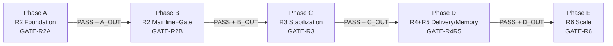

# feat: RAG Text2SQL v1.3 分阶段主线计划索引

## Overview

本计划将 v1.3 需求拆分为“主索引 + 5 个阶段子计划”，并在索引层统一以下治理要素：
- 跨阶段依赖与交接产物（禁止隐式前置条件）。
- R1-R36 全量 requirements 覆盖映射（单条需求可追踪到阶段 Gate）。
- 阶段 Gate 与证据字段统一（可审计、可回放、可回滚）。
- 风险触发条件、回滚动作、回滚证据留存标准。

## Problem Frame

当前 002-006 子计划已形成，但索引层仍缺少“统一治理合同”。若没有统一合同，会出现：
- 需求覆盖无法快速核对（R1-R36 可能遗漏或重复认领）。
- 阶段 Gate 口径不一致（同名证据字段在不同阶段语义漂移）。
- 风险与回滚策略碎片化（出现问题时无法按阶段快速止损）。

## Requirements Trace

- R1-R5: 由索引计划直接承载（阶段治理、依赖链、证据合同与路径规范）。
- R6-R24: 通过 Phase A/B 子计划落地，并在本索引中统一 Gate 与证据字段。
- R25-R32: 通过 Phase C/D 子计划落地，并在本索引中约束交接产物与门禁延续。
- R33-R36: 通过 Phase E 子计划落地，并在本索引中约束“不降级安全与可观测”红线。

## Scope Boundaries

- 本索引文件不承载实现代码与实现细节，具体改造由 002-006 子计划执行。
- 本索引文件只定义阶段治理合同，不替代子计划中的实施单元。
- 本索引文件不引入绝对路径，所有引用均为仓库相对路径。

## Context & Research

### Relevant Code and Patterns

- 主链编排：`apps/backend/src/modules/agent/graph/langgraph.runtime.ts`
- 节点与状态：`apps/backend/src/modules/agent/graph/graph.builder.ts`、`apps/backend/src/modules/agent/graph/langgraph.state.ts`
- 数据层基线：`apps/backend/prisma/schema.prisma`
- 质量与健康检查：`apps/backend/src/modules/system/health.controller.ts`

### Institutional Learnings

- 历史计划执行经验显示，大型需求需分阶段并绑定阶段门禁，才能降低“中途改口径”风险。

### External References

- `docs/RAG-Text2SQL-可行方案-v1.3.md`
- `docs/方案-架构-v1.2.md`
- `docs/Text2SQL Agent 图谱设计与落地优化方案.md`

## Key Technical Decisions

- 决策 1：以子计划文件作为执行单元，以索引文件作为阶段治理单元。
- 决策 2：所有阶段必须有“进入条件 + 退出条件 + 回滚条件”。
- 决策 3：阶段间仅通过显式交接产物衔接，禁止隐式假设。

## Cross-Phase Delivery Contract

### Phased Delivery

| 阶段 | Gate ID | 子计划文件 | 核心目标 | 进入条件 | 退出条件（必须带证据包） |
|---|---|---|---|---|---|
| Phase A (R2 Foundation) | `GATE-R2A` | `docs/plans/2026-04-17-002-feat-rag-r2-foundation-ingestion-index-plan.md` | 完成 ingestion/chunk/index 版本化底座 | 当前基线可运行 | R6-R12 达成；索引可构建、可激活、可回滚 |
| Phase B (R2 Mainline+Gate) | `GATE-R2B` | `docs/plans/2026-04-17-003-feat-rag-r2-retrieval-agent-gate-plan.md` | 完成检索重排主链接入与 R2 指标门禁 | `GATE-R2A=PASS` | R13-R24 达成；R20 阈值达标；run 级可回放 |
| Phase C (R3 Stabilization) | `GATE-R3` | `docs/plans/2026-04-17-004-feat-rag-r3-semantic-registry-plan.md` | 完成语义层注册中心与 planner 稳定化 | `GATE-R2B=PASS` | R25-R27 达成；语义版本锁与回退链路可验证 |
| Phase D (R4+R5 Delivery/Memory) | `GATE-R4R5` | `docs/plans/2026-04-17-005-feat-rag-r4-delivery-sandbox-r5-memory-plan.md` | 完成交付协议、沙箱与记忆晋升闭环 | `GATE-R3=PASS` | R28-R32 达成；沙箱 fail-closed；记忆晋升可审计回放 |
| Phase E (R6 Scale) | `GATE-R6` | `docs/plans/2026-04-17-006-feat-rag-r6-scale-optimization-plan.md` | 完成多数据源规模化与性能治理 | `GATE-R4R5=PASS` | R33-R36 达成；优化不破坏前序安全与审计门禁 |

### Cross-Phase Dependency Graph

### Handoff Artifact Contract

| 输出包 | 生产阶段 | 消费阶段 | 最小内容 |
|---|---|---|---|
| `A_OUT` | Phase A | Phase B | `rag_index_version`、`active_snapshot`、ingestion/chunk schema 校验报告、基础回滚演练记录 |
| `B_OUT` | Phase B | Phase C | `retrieval_bundle` 合同样本、R2 Gate 指标快照、run 回放样本、降级统计 |
| `C_OUT` | Phase C | Phase D | 语义注册中心版本清单、planner 版本锁回放、语义回退演练记录 |
| `D_OUT` | Phase D | Phase E | Answer/Evidence/Artifact 合同样本、沙箱阻断报告、记忆晋升审计链 |
| `E_OUT` | Phase E | 运维与持续演进 | 多数据源运行手册、预算策略、加速开关回滚演练、全链路门禁延续证明 |

## Requirements Coverage Map (R1-R36)

证据字段缩写：
- `M` = metrics_snapshot_ref
- `T` = test_report_ref
- `X` = trace_replay_ref
- `RB` = rollback_rehearsal_ref
- `DG` = degrade_report_ref
- `AU` = audit_log_ref

| Requirement | 摘要 | 归属阶段 | Gate | 子计划 | 证据字段 |
|---|---|---|---|---|---|
| R1 | 主索引 + 分阶段子计划 | Phase A | `GATE-R2A` | `docs/plans/2026-04-17-002-feat-rag-r2-foundation-ingestion-index-plan.md` | T |
| R2 | 每阶段定义目标/映射/依赖/验收/回滚 | Phase A | `GATE-R2A` | `docs/plans/2026-04-17-002-feat-rag-r2-foundation-ingestion-index-plan.md` | T,RB |
| R3 | 阶段依赖链强约束 | Phase A-E | `GATE-R2A`~`GATE-R6` | `docs/plans/2026-04-17-001-feat-rag-text2sql-v1-3-phased-plan-index.md` | T,RB |
| R4 | 每阶段可审计证据 | Phase A-E | `GATE-R2A`~`GATE-R6` | `docs/plans/2026-04-17-001-feat-rag-text2sql-v1-3-phased-plan-index.md` | M,T,X,RB |
| R5 | 仓库相对路径 | Phase A-E | `GATE-R2A`~`GATE-R6` | `docs/plans/2026-04-17-001-feat-rag-text2sql-v1-3-phased-plan-index.md` | T |
| R6 | 三类最小 ingestion 来源 | Phase A | `GATE-R2A` | `docs/plans/2026-04-17-002-feat-rag-r2-foundation-ingestion-index-plan.md` | T,M |
| R7 | `RagDocument` + 版本与 checksum | Phase A | `GATE-R2A` | `docs/plans/2026-04-17-002-feat-rag-r2-foundation-ingestion-index-plan.md` | T,X |
| R8 | profile 化 chunking | Phase A | `GATE-R2A` | `docs/plans/2026-04-17-002-feat-rag-r2-foundation-ingestion-index-plan.md` | T |
| R9 | chunk 可检索元数据 | Phase A | `GATE-R2A` | `docs/plans/2026-04-17-002-feat-rag-r2-foundation-ingestion-index-plan.md` | T,M |
| R10 | lexical+dense+graph 召回进入融合 | Phase A 构建 + Phase B 融合 | `GATE-R2A`(构建), `GATE-R2B`(融合) | 002(索引构建) + 003(检索融合) | T,M,DG |
| R11 | dense 无 pgvector 可运行 | Phase A | `GATE-R2A` | `docs/plans/2026-04-17-002-feat-rag-r2-foundation-ingestion-index-plan.md` | T,M |
| R12 | 索引版本化快照与原子激活 | Phase A | `GATE-R2A` | `docs/plans/2026-04-17-002-feat-rag-r2-foundation-ingestion-index-plan.md` | T,RB,AU |
| R13 | 结构化 `retrieval_bundle` | Phase B | `GATE-R2B` | `docs/plans/2026-04-17-003-feat-rag-r2-retrieval-agent-gate-plan.md` | T,X |
| R14 | 确定性融合 + 入选理由 | Phase B | `GATE-R2B` | `docs/plans/2026-04-17-003-feat-rag-r2-retrieval-agent-gate-plan.md` | T,X |
| R15 | 双级重排 + 可超时降级 | Phase B | `GATE-R2B` | `docs/plans/2026-04-17-003-feat-rag-r2-retrieval-agent-gate-plan.md` | T,DG,M |
| R16 | 主链新增三节点序列 | Phase B | `GATE-R2B` | `docs/plans/2026-04-17-003-feat-rag-r2-retrieval-agent-gate-plan.md` | T,X |
| R17 | 检索/重排失败可降级不中断 | Phase A 基础 + Phase B 完整 | `GATE-R2A`(索引隔离), `GATE-R2B`(检索降级) | 002(构建隔离) + 003(链路降级) | T,DG |
| R18 | `selected_context` 必须被 SQL 消费 | Phase B | `GATE-R2B` | `docs/plans/2026-04-17-003-feat-rag-r2-retrieval-agent-gate-plan.md` | T,X |
| R19 | RAG 指标体系 | Phase B | `GATE-R2B` | `docs/plans/2026-04-17-003-feat-rag-r2-retrieval-agent-gate-plan.md` | M,T |
| R20 | R2 默认阈值门禁 | Phase B | `GATE-R2B` | `docs/plans/2026-04-17-003-feat-rag-r2-retrieval-agent-gate-plan.md` | M,T |
| R21 | run 级完整回放 | Phase B | `GATE-R2B` | `docs/plans/2026-04-17-003-feat-rag-r2-retrieval-agent-gate-plan.md` | X,AU |
| R22 | 检索重排 trace/span 可见 | Phase B 持续到 E | `GATE-R2B`~`GATE-R6` | `docs/plans/2026-04-17-003-feat-rag-r2-retrieval-agent-gate-plan.md` | M,X,T |
| R23 | 与 SQL 安全链路协同 + `risk_tags` | Phase B 持续到 E | `GATE-R2B`~`GATE-R6` | `docs/plans/2026-04-17-003-feat-rag-r2-retrieval-agent-gate-plan.md` | T,X,AU |
| R24 | 上线前 rollback rehearsal 证据 | Phase A-E | `GATE-R2A`~`GATE-R6` | `docs/plans/2026-04-17-001-feat-rag-text2sql-v1-3-phased-plan-index.md` | RB,T |
| R25 | 语义层注册中心 + 版本锁 | Phase C | `GATE-R3` | `docs/plans/2026-04-17-004-feat-rag-r3-semantic-registry-plan.md` | T,X,AU |
| R26 | Skill Registry 协同 | Phase C | `GATE-R3` | `docs/plans/2026-04-17-004-feat-rag-r3-semantic-registry-plan.md` | T,X |
| R27 | Intent/Semantic/Physical 稳定化与回退 | Phase C | `GATE-R3` | `docs/plans/2026-04-17-004-feat-rag-r3-semantic-registry-plan.md` | T,X,RB |
| R28 | Answer/Evidence/Artifact 三层协议 | Phase D | `GATE-R4R5` | `docs/plans/2026-04-17-005-feat-rag-r4-delivery-sandbox-r5-memory-plan.md` | T,X |
| R29 | 受限后处理沙箱 | Phase D | `GATE-R4R5` | `docs/plans/2026-04-17-005-feat-rag-r4-delivery-sandbox-r5-memory-plan.md` | T,AU,RB |
| R30 | Candidate->Verified->Production 晋升 | Phase D | `GATE-R4R5` | `docs/plans/2026-04-17-005-feat-rag-r4-delivery-sandbox-r5-memory-plan.md` | T,AU |
| R31 | 事件驱动增量刷新 | Phase D | `GATE-R4R5` | `docs/plans/2026-04-17-005-feat-rag-r4-delivery-sandbox-r5-memory-plan.md` | T,M,AU |
| R32 | 审计回放链路 | Phase D | `GATE-R4R5` | `docs/plans/2026-04-17-005-feat-rag-r4-delivery-sandbox-r5-memory-plan.md` | X,AU,T |
| R33 | 多数据源规模化调度与生命周期 | Phase E | `GATE-R6` | `docs/plans/2026-04-17-006-feat-rag-r6-scale-optimization-plan.md` | T,M,RB |
| R34 | 缓存分层与预算感知策略 | Phase E | `GATE-R6` | `docs/plans/2026-04-17-006-feat-rag-r6-scale-optimization-plan.md` | T,M,DG |
| R35 | 图加速可选且可回退 | Phase E | `GATE-R6` | `docs/plans/2026-04-17-006-feat-rag-r6-scale-optimization-plan.md` | T,RB,DG |
| R36 | 优化不牺牲安全与可观测 | Phase E | `GATE-R6` | `docs/plans/2026-04-17-006-feat-rag-r6-scale-optimization-plan.md` | T,M,X,AU |

## Gate & Evidence Field Contract (一致性约束)

### Unified Gate Record Schema

每个阶段 Gate 报告必须包含以下字段（字段名固定，不允许阶段内重命名）：

| 字段 | 类型 | 说明 |
|---|---|---|
| `gate_id` | string | 阶段 Gate 唯一标识（如 `GATE-R2B`） |
| `phase_id` | string | 阶段标识（A/B/C/D/E） |
| `decision` | enum | `PASS` / `FAIL` / `BLOCKED` |
| `requirements` | string[] | 本 Gate 覆盖的 requirement id 列表 |
| `metrics_snapshot_ref` | string | 指标快照路径或引用 |
| `test_report_ref` | string | 关键测试报告路径或引用 |
| `trace_replay_ref` | string | 回放样本或回放任务引用 |
| `rollback_rehearsal_ref` | string | 回滚演练记录引用 |
| `degrade_report_ref` | string | 降级统计（如适用） |
| `audit_log_ref` | string | 审计日志/事件链路引用 |
| `evaluated_at` | string | RFC3339 时间戳 |
| `approved_by` | string | 评审责任人/角色 |

### Gate Decision Rule (按阶段)

| Gate | 决策规则 | 强制证据 |
|---|---|---|
| `GATE-R2A` | R6-R12 全通过，且 `active` 索引可回滚到上一版本 | `M + T + RB + AU` |
| `GATE-R2B` | R13-R24 通过；且满足 R20：Recall@20 >= 0.80、MRR@10 >= 0.65、检索+重排 P95 <= 800ms、降级率 <= 5% | `M + T + X + DG + RB` |
| `GATE-R3` | R25-R27 通过；语义版本锁与回退演练通过 | `T + X + RB + AU + DG` |
| `GATE-R4R5` | R28-R32 通过；沙箱 fail-closed 验证通过；记忆晋升可审计 | `T + AU + X + RB` |
| `GATE-R6` | R33-R36 通过；并证明前序安全/可观测门禁未退化 | `M + T + X + AU + RB` |

## Implementation Governance Units

- [ ] **Unit 1: 索引层治理合同落地**

**Goal:** 统一依赖图、交接产物与 Gate 字段，确保阶段切换可执行。

**Requirements:** R1-R5, R24

**Dependencies:** None

**Files:**
- Modify: `docs/plans/2026-04-17-001-feat-rag-text2sql-v1-3-phased-plan-index.md`

**Verification:**
- 索引层可独立回答“下一阶段能否进入、为什么能/不能进入、证据在哪”。

- [ ] **Unit 2: Requirements 覆盖核对与缺口阻断**

**Goal:** 对 R1-R36 执行单点归属与证据字段映射，防止遗漏。

**Requirements:** R1-R36

**Dependencies:** Unit 1

**Files:**
- Modify: `docs/plans/2026-04-17-001-feat-rag-text2sql-v1-3-phased-plan-index.md`

**Verification:**
- R1-R36 每条均能映射到 {阶段 + Gate + 子计划 + 证据字段}。

- [ ] **Unit 3: 风险触发与回滚策略矩阵统一**

**Goal:** 把阶段风险统一为可执行“触发条件 -> 回滚动作 -> 证据留存”格式。

**Requirements:** R3, R4, R24, R36

**Dependencies:** Unit 1, Unit 2

**Files:**
- Modify: `docs/plans/2026-04-17-001-feat-rag-text2sql-v1-3-phased-plan-index.md`

**Verification:**
- 任一阶段失败时可在 1 个矩阵内找到最小回滚路径与证据要求。

## System-Wide Boundary Conditions (跨阶段边界约束)

以下边界条件影响多个阶段，各子计划实施时必须遵守：

### B1: 零结果传播链路

任一阶段的"检索/规划/交付"环节产出空结果时，必须产出结构化降级响应（包含 `degrade_reason`），禁止静默传播空值或中断主链。各阶段的具体降级策略：
- Phase A: 空文档/空 chunk 拒绝入库并记录原因。
- Phase B: 零召回时产出空 bundle + `degrade_reason=zero_recall`。
- Phase C: 语义查询无匹配时回退上一稳定版本。
- Phase D: evidence 为空时 answer 仍可返回、附降级标记。
- Phase E: 缓存未命中时回退实时检索、不产出过期数据。

### B2: 并发安全边界

各阶段涉及的并发场景必须有显式保护：
- 并发 ingestion 同一数据源 → 分布式锁或乐观锁 + 幂等。
- 并发语义版本发布 → 版本号冲突检测 + 拒绝。
- 并发记忆晋升 → 状态机 + 幂等键。
- 并发索引构建 → 按 datasource 隔离 + 全局并发上限。

### B3: 资源耗尽与体积上限

各阶段必须对输入/中间产物设置合理上限：
- 单文档 chunk 数上限（建议 ≤ 5000，超过拒绝并告警）。
- selected_context 注入 SQL 生成时的 token 上限（必须裁剪到模型窗口安全范围内）。
- 事件 DLQ 积压阈值告警（建议 ≥ 100 条未消费时告警）。
- 沙箱执行时间与内存硬限制（超限强制终止、记录审计）。

### B4: 版本一致性传播

跨阶段使用的版本标识（`index_version`、`semantic_version`、`retrieval_bundle` 契约版本）必须在 trace/replay 中完整记录，且版本回退时下游缓存必须同步失效。

## System-Wide Impact

- **Interaction graph:** 执行入口由单计划改为索引编排，减少跨阶段隐式耦合。
- **Error propagation:** 失败定位收敛到“阶段 + Gate + 证据包”，降低排障路径长度。
- **State lifecycle risks:** 通过 `A_OUT/B_OUT/C_OUT/D_OUT/E_OUT` 强制阶段交接显式化。
- **API surface parity:** 协议变更需与 `packages/shared-types` 和阶段 Gate 证据同步更新。
- **Integration coverage:** Gate 强制功能、降级、安全、回放四类证据同场提交。
- **Unchanged invariants:** R2 前既有主链可运行能力必须保留，且优化阶段不得破坏审计能力。

## Risks & Rollback Strategy

| 风险 | 触发信号 | 最小回滚动作 | 证据留存 |
|------|------------|--------------|----------|
| R2 索引激活异常导致线上读取不一致 | `active` 切换后查询错误率突增 | 回滚到上一个 `active` 索引版本并冻结新构建 | `RB + AU + T` |
| 检索/重排延迟超阈值 | `retrieval+rerank P95 > 800ms` 持续超窗 | 关闭二级重排并降级为一级规则 | `M + DG + X` |
| 主链接入导致 SQL 质量回退 | Gate 样本集通过率下降 | 恢复无 RAG 路径开关并保留 `selected_context` 日志用于复盘 | `M + X + RB` |
| 语义版本漂移破坏 planner 稳定性 | 同输入不同版本结果分歧异常 | 锁回前一稳定语义版本，暂停新版本发布 | `T + X + RB + AU` |
| 沙箱策略失效（安全风险） | 出现越权执行或策略绕过样本 | 立即 fail-closed，禁用后处理扩展路径 | `T + AU + RB` |
| 记忆晋升污染线上行为 | 生产命中异常提升且回放无法解释 | 暂停晋升写入，回退到最近 verified 快照 | `AU + X + RB` |
| 多数据源编排放大故障 | 单源失败扩散到全局 | 切断故障源队列，仅保留健康源 | `M + AU + RB` |
| 图加速通道引入不稳定性 | 加速通道错误率或延迟劣化 | 关闭图加速 adapter，回退 Postgres 主线 | `DG + M + RB` |
| 优化阶段削弱审计能力 | 关键 trace/span 缺失 | 阻断 `GATE-R6`，恢复上一版本观测配置 | `X + AU + RB` |

## Open Questions

### Resolved During Planning

- 是否继续单文件计划：否，改为多文件阶段计划。
- 是否把 R3-R6 推迟到未来再规划：否，当前直接规划但按门禁分批执行。

### Cross-Phase Blocking Items (阶段入场阻塞追踪)

以下阻塞项由子计划声明，索引层统一追踪，阶段切换时必须逐条核验：

| 阻塞项 | 声明来源 | 影响 Gate | 消费阶段 | 状态 |
|---|---|---|---|---|
| R2 需冻结 `retrieval_bundle` 与 run replay 载荷字段版本 | 004 (R3) | `GATE-R3` 入场 | Phase C | 待 Phase B 退出时固化 |
| 语义版本号规则（单调递增 + 域内唯一）需确认并写入标准文档 | 004 (R3) | `GATE-R3` 入场 | Phase C | 待 Phase B 退出前确认 |
| R3 退出产物中 `semantic_version` 与技能证据字段需在 sync/stream 合同中冻结 | 005 (R4/R5) | `GATE-R4R5` 入场 | Phase D | 待 Phase C 退出时固化 |
| 安全团队确认沙箱策略白名单最小集合 | 005 (R4/R5) | `GATE-R4R5` 入场 | Phase D | 待 Phase C 退出前确认 |

### Deferred to Implementation

- [Affects R11,R34] dense 相似度路径在不同数据规模下的预算切换阈值。
- [Affects R20] 首轮灰度阶段是否按业务域分桶评估门禁阈值。
- [Affects R35] 图加速引入触发条件与关停回滚 SLO 细节。

## Documentation / Operational Notes

- 旧单文件 R2 计划保留为历史记录，并标记为 superseded。
- 后续每次阶段完成应先更新对应子计划状态，再更新索引计划摘要。
- 子计划若新增 Gate 字段，必须先回写本索引的 `Gate & Evidence Field Contract`，再进入实施。
- 执行过程统一记录在 `docs/plans/2026-04-17-001-feat-rag-text2sql-v1-3-phased-execution-log.md`，作为跨阶段进度与证据唯一入口。

## Sources & References

- **Origin document:** [docs/brainstorms/2026-04-14-text2sql-r2-rag-implementation-detail-requirements.md](docs/brainstorms/2026-04-14-text2sql-r2-rag-implementation-detail-requirements.md)
- Related plan: [docs/plans/2026-04-14-002-feat-postgres-hybrid-rag-pipeline-plan.md](docs/plans/2026-04-14-002-feat-postgres-hybrid-rag-pipeline-plan.md)
- External docs: [PostgreSQL Text Search](https://www.postgresql.org/docs/current/textsearch-controls.html)
