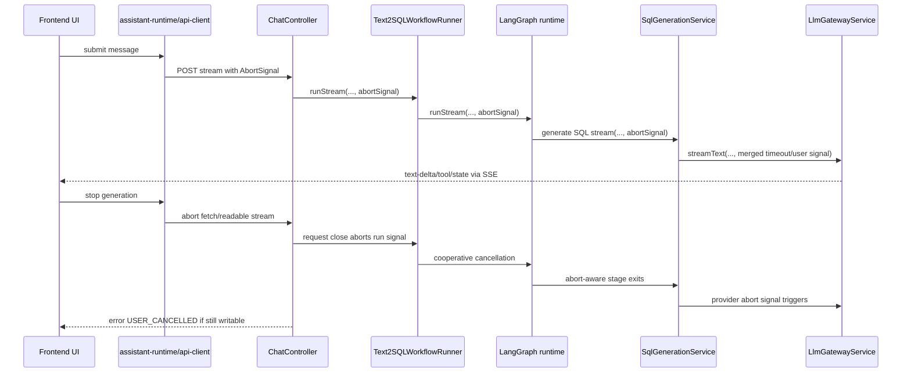
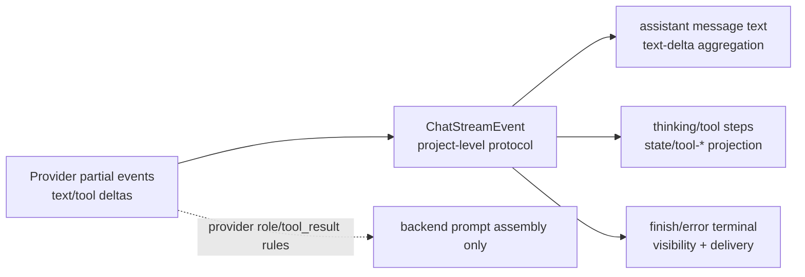

# feat: Chat Stream Protocol Toolkit and Cancellable Stream Runtime

## Overview

`packages/chat-stream-protocol` already exists and now owns the reusable SSE protocol layer: envelope creation, SSE parsing/framing, terminal guards, text aggregation, framework-light UI projections, and test fixtures. This refresh extends the original package-extraction plan into the remaining runtime work: make chat streams cancellable end-to-end, keep UI thinking/tool progress grounded in stream events, and document the `claude-code`-inspired event/message layering without copying its transport or full transcript system.

The implementation should preserve the external stream contract: `POST /api/v1/sessions/:sessionId/messages/stream` still emits `ChatStreamEvent` envelopes with `type/runId/sessionId/at/data`, and the canonical event taxonomy remains `start/text-delta/tool-call/tool-result/tool-error/state/finish/error` unless a later plan explicitly introduces a new terminal type.

## Problem Frame

The initial duplication problem is mostly addressed: backend stream tests and gateway smoke already consume `@text2sql/chat-stream-protocol`, and frontend/backend code already import helpers such as `readSseStream`, `writeSseEvent`, `createChatStreamEventEnvelope`, `collectTextDelta`, and `projectStreamEvent`.

The remaining gap is runtime control and contributor understanding. The frontend can pass an `AbortSignal` into `fetch`, but backend `chat.controller -> StreamMessageUsecase -> Text2SQLWorkflowRunner -> RunV2LangGraphStage -> Text2SqlV2LangGraphRunnerService -> GenerateSqlNode -> SqlGenerationService -> LlmGatewayService` does not yet carry a user cancellation signal to the LLM provider or tool execution path. This means a user-visible stop action can abort the browser reader while backend work may continue consuming model/tool resources. The UI also needs a clear stopped/cancelled state that preserves already streamed text and thinking steps.

The plan uses `claude-code` only as an architectural reference for two ideas: partial runtime events should be projected into user-visible messages rather than flattened into final text, and interrupt/cancel should be a first-class control signal. It does not migrate this project to WebSocket/ACP or copy `claude-code`'s full message taxonomy.

## Requirements Trace

- R1-R4. Keep `packages/chat-stream-protocol` as the internal protocol toolkit while `packages/shared-types` remains the canonical `ChatStreamEvent` schema owner.
- R5-R10. Preserve and harden server/client helpers for envelope creation, SSE framing, readable-stream parsing, terminal checks, malformed/partial/multi-block behavior, and text delta collection.
- R11-R16. Keep UI adapters framework-light and use stream events as the source of truth for thinking/tool/process visibility.
- R17-R24. Keep test helpers and first migration points aligned with existing backend e2e/integration, frontend runtime, and gateway smoke consumers.
- R25-R30. Add user interrupt/cancellation semantics from frontend stop action through backend route, workflow, LangGraph runner, SQL generation, and LLM gateway/provider calls.
- R31-R34. Add learning documentation that explains transport framing, protocol envelope, UI projection, cancellation, and why thinking UI is public workflow/tool state rather than model private chain-of-thought.
- R35-R40. Capture the `claude-code` event/message layering as a reference model while keeping the first implementation scoped to existing Text2SQL stream events and real consumers.
- R41-R43. Keep toolkit exports small, update stream standards/docs, and remove non-portable absolute links from learning docs.

## Scope Boundaries

- Do not change the public stream route, HTTP method, or envelope fields.
- Do not introduce a `cancelled` event type in this plan. Use existing `error` terminal semantics with a stable `USER_CANCELLED` code unless implementation proves the existing taxonomy cannot express the state safely.
- Do not move Text2SQL stage catalog, LangGraph state, delivery business logic, toast/session orchestration, or React state machines into `packages/chat-stream-protocol`.
- Do not expose provider role taxonomy directly to UI. `UserMessage` carrying `tool_result` remains a provider-protocol teaching point, not a frontend event contract.
- Do not implement `SystemMessage`, `AttachmentMessage`, `TombstoneMessage`, or full `ToolUseSummaryMessage` transcript semantics unless a concrete Text2SQL stream consumer exists.
- Do not require WebSocket, EventSource-only GET streams, ACP, or `claude-code` transport architecture.
- Do not make database/Prisma schema changes.

### Deferred to Separate Tasks

- First-class `cancelled` terminal event: separate compatibility plan if product wants cancellation distinct from existing `error` terminals.
- General Agent transcript system: separate plan if future work needs system/attachment/tombstone/replay message semantics beyond Text2SQL stream projection.
- Tool-use summary persistence: separate plan if summary needs to become persisted run metadata rather than UI-only projection.

## Context & Research

### Relevant Code and Patterns

- Protocol toolkit: `packages/chat-stream-protocol/src/types.ts`, `packages/chat-stream-protocol/src/server.ts`, `packages/chat-stream-protocol/src/client.ts`, `packages/chat-stream-protocol/src/ui.ts`, `packages/chat-stream-protocol/src/test.ts`, `packages/chat-stream-protocol/src/protocol.spec.ts`
- Shared schema owner: `packages/shared-types/src/api.ts`, `packages/shared-types/src/api.contract.spec.ts`
- Backend stream entry: `apps/backend/src/modules/conversation/chat/chat.controller.ts`
- Backend stream application path: `apps/backend/src/modules/conversation/chat/chat.service.ts`, `apps/backend/src/modules/conversation/chat/application/stream-message.usecase.ts`, `apps/backend/src/modules/conversation/application/workflow/text2sql-workflow-runner.service.ts`
- V2 runtime path: `apps/backend/src/modules/conversation/runtime/stages/run-v2-langgraph.stage.ts`, `apps/backend/src/modules/conversation/runtime/langgraph/text2sql-v2-langgraph-runner.service.ts`, `apps/backend/src/modules/conversation/runtime/langgraph/text2sql-v2-langgraph.state.ts`, `apps/backend/src/modules/conversation/runtime/langgraph/text2sql-v2-langgraph.graph.ts`
- SQL/LLM stream path: `apps/backend/src/modules/conversation/agent/nodes/generate-sql.node.ts`, `apps/backend/src/modules/conversation/agent/sql/sql-generation.service.ts`, `apps/backend/src/modules/llm/provider-router.service.ts`, `apps/backend/src/modules/llm/llm-gateway.interface.ts`, `apps/backend/src/modules/llm/llm-gateway.service.ts`
- Frontend stream path: `apps/frontend/src/lib/api-client.ts`, `apps/frontend/src/components/chat/assistant-runtime.ts`, `apps/frontend/src/components/chat/assistant-thread.tsx`, `apps/frontend/src/components/chat/assistant-composer.tsx`, `apps/frontend/src/components/chat-panel.tsx`
- Frontend projection/display: `apps/frontend/src/components/chat/run-visibility-mapper.ts`, `apps/frontend/src/components/chat/assistant-thinking-panel.tsx`
- Tests and smoke: `apps/backend/test/unit/llm-gateway.service.spec.ts`, `apps/backend/test/unit/text2sql-workflow-runner.spec.ts`, `apps/backend/test/e2e/chat-stream-api.spec.ts`, `apps/backend/test/integration/delivery-contract.spec.ts`, `apps/frontend/tests/unit/chat-panel.spec.tsx`, `apps/frontend/tests/unit/run-visibility-mapper.spec.ts`, `tests/smoke/nginx-dev-gateway-smoke.mjs`
- Standards: `docs/standards/llm-stream-tool-migration-spec.md`, `docs/standards/frontend-react-shadcn-spec.md`

### Institutional Learnings

- `docs/solutions/workflow-issues/frontend-vitest-hang-reactflow-oninit-mock-loop-2026-04-23.md`: frontend tests that wire callbacks to state setters can hang if mocks repeatedly trigger lifecycle callbacks. Apply this when testing stop/abort UI: prefer explicit user actions and one-shot async gates over effects that loop.
- `docs/solutions/workflow-issues/ce-compound-full-mode-workflow-context-pass-through-2026-04-23.md`: preserve evidence boundaries in docs. Apply this to learning docs by clearly separating verified local paths from `claude-code` analogy.

### External References

- No external research was needed. The work extends existing local patterns, and the relevant third-party surface (`ai` stream/generate `abortSignal`) is already used in `apps/backend/src/modules/llm/llm-gateway.service.ts`.

## Key Technical Decisions

- Keep `ChatStreamEvent` in `packages/shared-types`: `packages/chat-stream-protocol` remains helper owner, not schema owner.
- Reuse existing `error` terminal for user cancellation in the first implementation: emit or persist `code: "USER_CANCELLED"` where possible, avoiding taxonomy churn.
- Treat cancellation as a control plane, not just reader cleanup: the same abort reason must travel through route close listeners, workflow inputs, LangGraph stream options, SQL generation options, and LLM gateway options.
- Preserve partial output on cancel: the frontend should keep already streamed answer text and thinking steps, stop loading, and show a readable stopped/cancelled state.
- Keep provider-specific message roles behind backend assembly: `tool_result` as user-role provider input should be documented as an internal/provider constraint, not surfaced to the UI contract.
- Keep tool summary and tombstone as guarded future concepts: they can shape projection design, but they should not enter the protocol until there is a concrete stream fallback, replay correction, or collapsed-summary consumer.

## Open Questions

### Resolved During Planning

- **Should cancellation add a new event type now?** No. Use existing `error` terminal with `USER_CANCELLED` first; defer `cancelled` event taxonomy to a separate compatibility plan.
- **Should `claude-code` message classes be copied?** No. Use its layering as a reference and map only real Text2SQL stream consumers.
- **Should external SSE/parser libraries be introduced?** No planning requirement. Existing toolkit helpers are already in place and tested.

### Deferred to Implementation

- Exact helper names for request-close abort controllers and signal composition can be chosen during implementation, provided the chain is testable.
- Whether `assistant-ui` exposes a built-in cancel control in the current version should be verified during implementation. If unavailable, use a local stop control wired to the runtime abort mechanism.
- Persisted cancellation shape should use the existing `SqlRun`/trace fields where possible; exact metadata placement depends on current persistence model constraints.
- Tool execution cancellation depth may vary by tool. The plan requires propagation and cooperative checks where the current tool boundary allows it; hard-killing non-cooperative operations is a separate concern.

## Output Structure

The package already follows this shape. New work should preserve it and add only narrowly scoped helpers/tests if needed.

```text
packages/chat-stream-protocol/
  src/
    index.ts
    types.ts
    server.ts
    client.ts
    ui.ts
    test.ts
    protocol.spec.ts
```

## High-Level Technical Design

> *This illustrates the intended approach and is directional guidance for review, not implementation specification. The implementing agent should treat it as context, not code to reproduce.*





## Implementation Units

- [x] **Unit 1: Protocol toolkit core**

**Goal:** Keep the existing toolkit package as the protocol owner for helper code.

**Requirements:** R1-R10, R17-R20, R41

**Dependencies:** None

**Files:**
- Existing: `packages/chat-stream-protocol/package.json`
- Existing: `packages/chat-stream-protocol/src/types.ts`
- Existing: `packages/chat-stream-protocol/src/server.ts`
- Existing: `packages/chat-stream-protocol/src/client.ts`
- Existing: `packages/chat-stream-protocol/src/test.ts`
- Existing: `packages/chat-stream-protocol/src/protocol.spec.ts`

**Approach:**
- Preserve the existing `types / server / client / ui / test` export grouping.
- Keep `packages/shared-types` as the only schema owner.
- Add only missing helpers discovered by later units; avoid widening the package into generic frontend/backend utilities.

**Patterns to follow:**
- `packages/chat-stream-protocol/src/index.ts`
- `packages/chat-stream-protocol/src/protocol.spec.ts`

**Test scenarios:**
- Happy path: round-trip serialized `start`, `text-delta`, and `finish` events through parser helpers.
- Edge case: partial chunks, empty/comment blocks, multi-line data blocks, and trailing incomplete buffers behave with stable parse results.
- Error path: event-name/payload-type mismatch and malformed JSON are reported by toolkit helpers.

**Verification:**
- Toolkit tests pass and package exports remain small and grouped.

- [x] **Unit 2: Backend SSE writer and event envelope adoption**

**Goal:** Keep backend stream route and workflow event creation behind toolkit helpers.

**Requirements:** R5-R7, R20-R24

**Dependencies:** Unit 1

**Files:**
- Existing/modify as needed: `apps/backend/src/modules/conversation/chat/chat.controller.ts`
- Existing/modify as needed: `apps/backend/src/modules/conversation/application/workflow/text2sql-workflow-runner.service.ts`
- Existing/modify as needed: `apps/backend/src/modules/conversation/text2sql/stream/text2sql-stream-event.mapper.ts`
- Test: `apps/backend/test/unit/text2sql-workflow-runner.spec.ts`
- Test: `apps/backend/test/e2e/chat-stream-api.spec.ts`

**Approach:**
- Keep `Text2SqlStreamEventMapper` responsible for business mapping only.
- Keep `writeSseEvent`/`writeErrorEvent` as the transport boundary.
- Preserve current stream headers, route, status, and callback shape.

**Patterns to follow:**
- `packages/chat-stream-protocol/src/server.ts`
- `apps/backend/src/modules/conversation/application/workflow/text2sql-workflow-runner.service.ts`

**Test scenarios:**
- Happy path: `start -> state/text/tool -> finish` events share one run id and session id.
- Error path: route or workflow failure emits `error` with structured data.
- Integration: backend e2e stream contract still sees `text/event-stream` and valid envelopes.

**Verification:**
- Backend stream tests no longer depend on duplicated writer/parser rules.

- [x] **Unit 3: Frontend stream reader and UI projection adoption**

**Goal:** Keep frontend stream reading and generic event projection behind toolkit helpers.

**Requirements:** R8-R16, R20-R24

**Dependencies:** Unit 1

**Files:**
- Existing/modify as needed: `apps/frontend/src/lib/api-client.ts`
- Existing/modify as needed: `apps/frontend/src/components/chat/assistant-runtime.ts`
- Existing/modify as needed: `apps/frontend/src/components/chat/run-visibility-mapper.ts`
- Existing/modify as needed: `apps/frontend/src/components/chat-panel.tsx`
- Test: `apps/frontend/tests/unit/chat-panel.spec.tsx`
- Test: `apps/frontend/tests/unit/run-visibility-mapper.spec.ts`
- Test: `apps/frontend/tests/unit/chat-rag-sync-stream-consistency.spec.tsx`

**Approach:**
- Keep `readSseStream`, `collectTextDelta`, and `projectStreamEvent` as the shared protocol-to-runtime seam.
- Keep delivery normalization and React state updates in frontend app code.
- Preserve terminal monotonicity and same-runId semantics.

**Patterns to follow:**
- `packages/chat-stream-protocol/src/client.ts`
- `packages/chat-stream-protocol/src/ui.ts`
- `apps/frontend/src/components/chat-panel.tsx`

**Test scenarios:**
- Happy path: `text-delta` aggregates into assistant message content with `metadata.custom.runId`.
- Edge case: pending-before-first-event shows connecting/thinking state.
- Regression: duplicate/out-of-order terminal and loading events do not regress visibility state.

**Verification:**
- Frontend stream tests pass without page-level parser duplication.

- [x] **Unit 4: Shared test helper and smoke alignment**

**Goal:** Keep backend tests and gateway smoke aligned with toolkit parsing/envelope assertions.

**Requirements:** R17-R19, R21

**Dependencies:** Units 1-3

**Files:**
- Existing/modify as needed: `apps/backend/test/e2e/chat-stream-api.spec.ts`
- Existing/modify as needed: `apps/backend/test/integration/delivery-contract.spec.ts`
- Existing/modify as needed: `tests/smoke/nginx-dev-gateway-smoke.mjs`
- Test: `packages/chat-stream-protocol/src/protocol.spec.ts`

**Approach:**
- Use toolkit parser/assertion helpers in backend tests and smoke where runtime format allows.
- Keep `packages/shared-types` independent from toolkit to avoid schema-owner cycles.

**Test scenarios:**
- Happy path: e2e stream tests parse with toolkit and assert full envelope consistency.
- Error path: smoke first-event parser reports stream-specific invalid block errors.

**Verification:**
- No active duplicate parser remains in backend e2e/integration tests.

- [ ] **Unit 5: Abort signal primitives and LLM gateway cancellation support**

**Goal:** Add reusable backend cancellation primitives and make LLM stream/generate paths accept user abort signals while preserving runtime timeout behavior.

**Requirements:** R25-R30

**Dependencies:** Units 1-4

**Files:**
- Modify: `apps/backend/src/modules/llm/llm-gateway.interface.ts`
- Modify: `apps/backend/src/modules/llm/llm-gateway.service.ts`
- Modify: `apps/backend/src/modules/llm/provider-router.service.ts`
- Modify: `apps/backend/src/modules/conversation/agent/sql/sql-generation.service.ts`
- Test: `apps/backend/test/unit/llm-gateway.service.spec.ts`
- Test: `apps/backend/test/unit/sql-generation.service.spec.ts`

**Approach:**
- Extend `LlmGateway.stream` options with `abortSignal?: AbortSignal`.
- Extend `LlmGateway.generate` only if stream fallback or sync generation needs user cancellation; otherwise keep sync unchanged and document why.
- Compose timeout and user abort into a single signal before calling `streamText`.
- Distinguish timeout abort from user cancellation. User cancellation should not trigger the existing recoverable timeout fallback to non-stream generation.
- In mock mode, check abort state between emitted lines so tests can prove cooperative cancellation.

**Patterns to follow:**
- Existing `AbortSignal.timeout(runtime.streamTimeoutMs ?? runtime.timeoutMs)` usage in `apps/backend/src/modules/llm/llm-gateway.service.ts`
- Existing stream timeout fallback tests in `apps/backend/test/unit/llm-gateway.service.spec.ts`

**Test scenarios:**
- Happy path: when no user signal is provided, stream still uses configured `streamTimeoutMs`.
- Happy path: when a non-aborted user signal is provided, `streamText` receives a signal that aborts when either timeout or user signal aborts.
- Error path: user-aborted stream throws or maps to a cancellation-domain error/code and does not call `generateText` fallback.
- Error path: timeout abort still follows existing recoverable behavior where appropriate.
- Edge case: already-aborted user signal fails fast before consuming provider stream.
- Integration: `SqlGenerationService.stream` forwards `abortSignal` through provider router to gateway.

**Verification:**
- LLM gateway tests prove timeout and user-cancel semantics are distinguishable.

- [ ] **Unit 6: Backend request-close propagation through workflow and LangGraph**

**Goal:** Carry cancellation from HTTP request/response close through stream usecase, workflow runner, LangGraph runtime state, and SQL generation stage.

**Requirements:** R25-R30

**Dependencies:** Unit 5

**Files:**
- Modify: `apps/backend/src/modules/conversation/chat/chat.controller.ts`
- Modify: `apps/backend/src/modules/conversation/chat/chat.service.ts`
- Modify: `apps/backend/src/modules/conversation/chat/application/stream-message.usecase.ts`
- Modify: `apps/backend/src/modules/conversation/application/workflow/text2sql-workflow-runner.service.ts`
- Modify: `apps/backend/src/modules/conversation/runtime/stages/run-v2-langgraph.stage.ts`
- Modify: `apps/backend/src/modules/conversation/runtime/langgraph/text2sql-v2-langgraph-runner.service.ts`
- Modify: `apps/backend/src/modules/conversation/runtime/langgraph/text2sql-v2-langgraph.state.ts`
- Modify: `apps/backend/src/modules/conversation/runtime/langgraph/text2sql-v2-langgraph.graph.ts`
- Modify: `apps/backend/src/modules/conversation/agent/nodes/generate-sql.node.ts`
- Test: `apps/backend/test/unit/text2sql-workflow-runner.spec.ts`
- Test: `apps/backend/test/unit/langgraph-runtime.spec.ts`
- Test: `apps/backend/test/e2e/chat-stream-api.spec.ts`

**Approach:**
- In `chat.controller.ts`, create a run-scoped abort controller for the stream request.
- Listen to request/response close or abort events, clean listeners in `finally`, and avoid writing extra bytes after `res.writableEnded`.
- Add `abortSignal?: AbortSignal` to stream input types and pass it through every layer.
- Store `abortSignal` in LangGraph stream options/state so `generate-sql` can pass it into `GenerateSqlNode.run`.
- Add cooperative abort checks before starting expensive stages and before/after LLM/tool streaming where local boundaries allow.
- If the response remains writable, emit an `error` terminal with `code: "USER_CANCELLED"`; if not writable, still return/persist a cancellation outcome.

**Patterns to follow:**
- Current stream route in `apps/backend/src/modules/conversation/chat/chat.controller.ts`
- Current V2 stream options in `apps/backend/src/modules/conversation/runtime/langgraph/text2sql-v2-langgraph.state.ts`
- Current `onLlmEvent` propagation from `text2sql-v2-langgraph.graph.ts` to `GenerateSqlNode`

**Test scenarios:**
- Happy path: non-cancelled stream still emits `start`, intermediate events, and `finish`.
- Error path: abort before first LLM event produces/persists failed or cancelled run outcome without continuing to provider stream.
- Error path: abort during `text-delta` streaming stops further LLM events and does not emit `finish`.
- Error path: abort after `tool-call` but before `tool-result` records a clear cancellation outcome and does not leave UI/run in loading.
- Edge case: response already closed prevents writing cancellation terminal but still cleans listeners and persistence path.
- Integration: `runV2LangGraphStage.runStream` receives `abortSignal` from workflow runner.

**Verification:**
- Unit tests prove the abort signal reaches the LangGraph/generate-sql boundary and cancellation does not run normal finish flow.

- [ ] **Unit 7: Cancellation outcome persistence and terminal semantics**

**Goal:** Ensure cancelled runs are visible, explainable, and not stuck in loading across stream UI, run view, and persisted trace.

**Requirements:** R26-R30

**Dependencies:** Units 5-6

**Files:**
- Modify: `apps/backend/src/modules/conversation/application/workflow/text2sql-workflow-runner.service.ts`
- Modify: `apps/backend/src/modules/conversation/text2sql/stages/persist-run.stage.ts` if persistence mapping requires adjustment
- Modify: `packages/chat-stream-protocol/src/ui.ts`
- Modify: `apps/frontend/src/components/chat/run-visibility-mapper.ts`
- Test: `apps/backend/test/unit/text2sql-workflow-runner.spec.ts`
- Test: `apps/backend/test/e2e/chat-stream-api.spec.ts`
- Test: `apps/frontend/tests/unit/run-visibility-mapper.spec.ts`

**Approach:**
- Normalize user cancellation to a stable code, recommended `USER_CANCELLED`.
- Persist a run with `status: "failed"` unless the current domain model already has a safer non-failed cancellation status. Do not invent a new `RunStatus` in this plan.
- Set trace stream status to `failed` and include cancellation-specific error details so run read/replay can explain what happened.
- Update `projectStreamEvent` or frontend mapper to treat `USER_CANCELLED` as terminal and user-stopped, not as an unhandled provider failure.
- Preserve partial text and thinking steps already emitted.

**Patterns to follow:**
- Existing graph-failure persistence path in `Text2SQLWorkflowRunner.runStream`
- Existing terminal status monotonicity helpers in `packages/chat-stream-protocol/src/ui.ts`

**Test scenarios:**
- Happy path: normal failed provider errors still show error visibility.
- Error path: `error` event with `code: "USER_CANCELLED"` is terminal and clears active loading state.
- Error path: persisted cancelled run has a clear error/cancellation message and `trace.streamStatus` is not `in_progress`.
- Edge case: if cancellation happens before a run id is visible to frontend, pending state is cleared and user sees a stopped/cancelled explanation.
- Regression: terminal error/cancelled state cannot be overwritten by a later loading patch.

**Verification:**
- Cancelled streams never leave `activeStreamRunId`, `thinkingRequestPending`, or persisted run status in an indefinite loading state.

- [ ] **Unit 8: Frontend stop generation UX**

**Goal:** Provide a clear user stop action that aborts the current stream, preserves partial output, and renders a stopped/cancelled state.

**Requirements:** R25-R26, R38-R39

**Dependencies:** Units 5-7

**Files:**
- Modify: `apps/frontend/src/components/chat/assistant-runtime.ts`
- Modify: `apps/frontend/src/components/chat/assistant-thread.tsx`
- Modify: `apps/frontend/src/components/chat/assistant-composer.tsx`
- Modify: `apps/frontend/src/components/chat/assistant-thinking-panel.tsx`
- Modify: `apps/frontend/src/components/chat-panel.tsx`
- Test: `apps/frontend/tests/unit/chat-panel.spec.tsx`
- Test: `apps/frontend/tests/unit/assistant-thinking-panel.spec.tsx`
- Test: `apps/frontend/tests/e2e/chat-demo-flow.spec.tsx`
- Test: `apps/frontend/tests/e2e/chat-mobile-smoke.spec.tsx`

**Approach:**
- Prefer assistant-ui's built-in abort/cancel mechanism if available in the installed version. If not, introduce a local active-stream abort controller bridge around the existing runtime callbacks.
- Add a stop control using existing shadcn/button conventions and lucide iconography, not a raw uncontrolled HTML control.
- Stop action should immediately clear spinner-only states and mark the active run as stopped/cancelled while preserving streamed text and thinking steps.
- Keep send behavior, IME behavior, mobile layout, and keyboard accessibility intact.
- Ensure stopping one stream does not poison the next stream's `AbortSignal`.

**Patterns to follow:**
- `apps/frontend/src/components/chat/assistant-composer.tsx`
- `apps/frontend/src/components/chat-panel.tsx`
- Existing frontend shadcn component usage under `apps/frontend/src/components/ui`

**Test scenarios:**
- Happy path: while a stream is active, a stop button is visible and enabled.
- Happy path: clicking stop aborts the generator/fetch signal and clears connecting/thinking spinner state.
- Happy path: partial `text-delta` content remains visible after stopping.
- Happy path: partial thinking steps remain visible and the panel no longer says work is still running.
- Edge case: stopping before the first `start` event clears pending state.
- Edge case: stopping after `tool-call` but before `tool-result` shows a stopped/cancelled state without pretending the tool completed.
- Regression: after stopping one stream, sending a new message uses a fresh non-aborted signal.
- Accessibility: stop control has an accessible name and is keyboard reachable at 375px width.

**Verification:**
- Frontend unit/e2e tests cover stop-before-first-event, stop-after-text, and stop-during-tool-progress states.

- [ ] **Unit 9: Message-layering guardrails and optional summary projection**

**Goal:** Encode the `claude-code` reference model as guardrails for Text2SQL projection without expanding the public protocol prematurely.

**Requirements:** R35-R40

**Dependencies:** Units 1, 3, 8

**Files:**
- Modify: `packages/chat-stream-protocol/src/ui.ts`
- Modify: `apps/frontend/src/components/chat/assistant-thinking-panel.tsx`
- Modify: `apps/backend/src/modules/conversation/text2sql/stream/text2sql-stream-event.mapper.ts` only if existing summary fields need normalization
- Test: `packages/chat-stream-protocol/src/protocol.spec.ts`
- Test: `apps/frontend/tests/unit/assistant-thinking-panel.spec.tsx`
- Test: `apps/backend/test/unit/text2sql-stream-event.mapper.spec.ts`

**Approach:**
- Keep stream event and display message layers conceptually separate in helper names and docs.
- Continue mapping `tool-call`, `tool-result`, and `tool-error` to thinking/tool lifecycle steps.
- If current event data already carries `summary`, use it to support collapsed/compact tool display; do not add `ToolUseSummaryMessage` as a new protocol event.
- Do not add tombstone/invalidated semantics unless implementation finds a real stream fallback or replay correction consumer.
- Ensure provider `tool_result` as user-role input is mentioned only in backend/provider assembly docs, not frontend runtime code.

**Patterns to follow:**
- `packages/chat-stream-protocol/src/ui.ts`
- `apps/backend/src/modules/conversation/text2sql/stream/text2sql-stream-event.mapper.ts`

**Test scenarios:**
- Happy path: text and tool events can interleave without tool steps overwriting assistant text.
- Happy path: tool event `summary` appears in thinking panel detail or compact view where available.
- Edge case: events without summary still render a safe synthesized detail.
- Regression: no new public event type is required for summaries.
- Guardrail: no tombstone/collapsed transcript event appears in `CHAT_STREAM_EVENT_TYPES`.

**Verification:**
- Event/message layering is visible in tests and docs without changing the stream taxonomy.

- [ ] **Unit 10: Learning docs, standards, and contributor guide updates**

**Goal:** Make stream architecture understandable and keep repo standards aligned with the implemented toolkit/cancellation path.

**Requirements:** R31-R34, R36-R43

**Dependencies:** Units 5-9

**Files:**
- Modify: `docs/leran/A2A协议.md`
- Modify: `docs/standards/llm-stream-tool-migration-spec.md`
- Modify: `README.md`
- Modify: `AGENTS.md` if scripts, gates, or MUST-level standards change
- Test: `scripts/check-docs-rag-understanding.mjs` only if RAG understanding docs are touched
- Test: `tests/smoke/docs-rag-understanding-contract-smoke.mjs` only if RAG understanding docs are touched

**Approach:**
- Explain SSE in three layers: transport framing, protocol envelope, and UI projection.
- Add the shortest local path walkthrough: `ChatController -> writeSseEvent -> readSseStream -> streamMessageEvents -> assistant-runtime/chat-panel -> projectStreamEvent`.
- Add cancellation walkthrough: frontend stop/abort, backend request close, workflow/LangGraph propagation, LLM gateway signal composition, persisted outcome.
- Add a `claude-code` comparison section that maps event/message concepts to this project and states what is intentionally not copied.
- Replace any machine-local absolute links in `docs/leran/A2A协议.md` with repo-relative paths.
- Update `docs/standards/llm-stream-tool-migration-spec.md` with toolkit ownership and cancellation expectations.

**Patterns to follow:**
- `docs/standards/llm-stream-tool-migration-spec.md`
- Existing requirement doc section `Code-Level Walkthrough` in `docs/brainstorms/2026-04-30-chat-stream-protocol-toolkit-requirements.md`

**Test scenarios:**
- Test expectation: none for pure docs, unless implementation touches docs with existing contract-check scripts.
- Documentation review: manually verify every file path is repo-relative and the docs do not claim private model chain-of-thought is displayed.

**Verification:**
- A new contributor can identify protocol owner, stream flow, stop flow, and message-layering boundaries without reading unrelated controller/page code first.

- [ ] **Unit 11: Final gate and regression verification plan**

**Goal:** Close the work with targeted unit/integration/e2e coverage and required stream/Text2SQL gates.

**Requirements:** All requirements, especially R13, R18-R21, R25-R30

**Dependencies:** Units 5-10

**Files:**
- Test: `packages/chat-stream-protocol/src/protocol.spec.ts`
- Test: `apps/backend/test/unit/llm-gateway.service.spec.ts`
- Test: `apps/backend/test/unit/text2sql-workflow-runner.spec.ts`
- Test: `apps/backend/test/unit/langgraph-runtime.spec.ts`
- Test: `apps/backend/test/e2e/chat-stream-api.spec.ts`
- Test: `apps/backend/test/integration/delivery-contract.spec.ts`
- Test: `apps/frontend/tests/unit/chat-panel.spec.tsx`
- Test: `apps/frontend/tests/unit/run-visibility-mapper.spec.ts`
- Test: `apps/frontend/tests/unit/assistant-thinking-panel.spec.tsx`
- Test: `apps/frontend/tests/e2e/chat-demo-flow.spec.tsx`
- Test: `tests/smoke/nginx-dev-gateway-smoke.mjs`

**Approach:**
- Treat cancellation as cross-layer behavior. Unit tests should prove signal propagation and terminal state; integration/e2e tests should prove stream contract remains stable.
- Keep package-level tests focused on protocol mechanics, not Text2SQL business semantics.
- Keep backend/focused gates aligned with AGENTS stream and Text2SQL v2 instructions.

**Test scenarios:**
- Package: SSE parse/framing and UI projection tests pass.
- Backend unit: LLM user abort is not misclassified as provider timeout.
- Backend unit: workflow persists cancellation outcome and skips normal finish on cancellation.
- Backend e2e: stream contract still emits valid envelopes and terminal events for normal/rejected/error flows.
- Frontend unit: stop action clears active loading state and preserves partial output.
- Frontend e2e: chat send/stream/thinking/stop path works at desktop and mobile widths.
- Smoke: unified gateway first stream event remains valid through `http://localhost:3000`.
- Static/quality: no legacy duplicate parser or unsupported event taxonomy drift.

**Verification:**
- Implementation completion should show these verification outcomes:
  - protocol toolkit lint and protocol tests pass
  - backend lint, unit/integration tests, e2e stream coverage, and build pass
  - frontend lint, unit/e2e stream UI coverage, and build pass
  - gateway smoke confirms first stream event remains valid through the unified local entry when the dev stack is running
  - Text2SQL v2 eval gate, focused coverage gate, and no-legacy-compat gate pass for the affected stream/runtime surfaces

## System-Wide Impact

- **Interaction graph:** Stop/cancel now affects UI runtime, fetch/readable stream, Nest controller request lifecycle, workflow runner, LangGraph stream state, SQL generation, provider router, and LLM gateway.
- **Error propagation:** User cancellation should be distinguishable from provider timeout, provider malformed response, tool failure, and business rejection. It should clear UI loading and persist an explainable terminal outcome.
- **State lifecycle risks:** Cancellation can happen before `start`, after `start`, during token streaming, during tool execution, after tool call but before result, or during enrichment/persistence. Each state must avoid indefinite loading.
- **API surface parity:** Public stream event taxonomy remains unchanged. Sync endpoint behavior should not regress, and stream/sync delivery evidence parity remains governed by existing tests.
- **Integration coverage:** Unit tests alone are insufficient; frontend stop UI and backend persisted outcome both need cross-layer coverage.
- **Unchanged invariants:** `ChatStreamEvent` schema owner remains `packages/shared-types`; protocol helper owner remains `packages/chat-stream-protocol`; business stage semantics remain under conversation/Text2SQL modules.

## Risks & Dependencies

| Risk | Mitigation |
|------|------------|
| User abort is mistaken for provider timeout and triggers non-stream fallback | Add explicit abort reason/code checks in LLM gateway tests and skip fallback for user cancellation |
| Response is already closed before cancellation terminal can be written | Persist cancellation outcome and clear backend listeners even when no SSE terminal can be sent |
| Tool execution cannot be forcibly interrupted | Propagate signal and add cooperative checks; document non-cooperative tool limits as implementation notes |
| Stop UI fights assistant-ui internal runtime state | Prefer built-in assistant-ui abort controls if present; otherwise isolate local stop bridge and test new send after stop |
| Adding message-layer concepts expands protocol too far | Keep `CHAT_STREAM_EVENT_TYPES` unchanged and cover guardrails in tests/docs |
| Existing ignored docs/plans are not visible in git diff | Mention ignored doc behavior in handoff; implementation can still use local plan artifact |

## Documentation / Operational Notes

- This plan updates an ignored `docs/plans` artifact in the current repo policy. The file is still useful locally, but staging it requires deliberate repo policy action.
- Implementation changes touch code files, so after code modification sessions run `graphify update .` per AGENTS guidance.
- No Prisma migration is involved.
- After frontend stop UI changes, verify at 375px width and keyboard access.
- Gateway smoke needs a running local stack through `http://localhost:3000`.

## Sources & References

- **Origin document:** `docs/brainstorms/2026-04-30-chat-stream-protocol-toolkit-requirements.md`
- Protocol toolkit: `packages/chat-stream-protocol/src/index.ts`
- Shared stream schema: `packages/shared-types/src/api.ts`
- Backend stream route: `apps/backend/src/modules/conversation/chat/chat.controller.ts`
- Backend workflow: `apps/backend/src/modules/conversation/application/workflow/text2sql-workflow-runner.service.ts`
- LangGraph runtime: `apps/backend/src/modules/conversation/runtime/langgraph/text2sql-v2-langgraph.graph.ts`
- LLM gateway: `apps/backend/src/modules/llm/llm-gateway.service.ts`
- Frontend stream runtime: `apps/frontend/src/components/chat/assistant-runtime.ts`
- Frontend chat panel: `apps/frontend/src/components/chat-panel.tsx`
- Stream standard: `docs/standards/llm-stream-tool-migration-spec.md`
